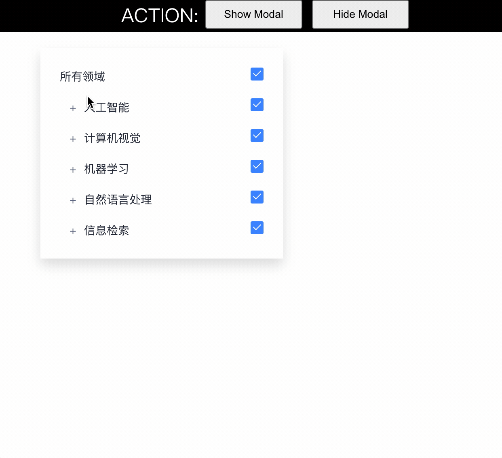
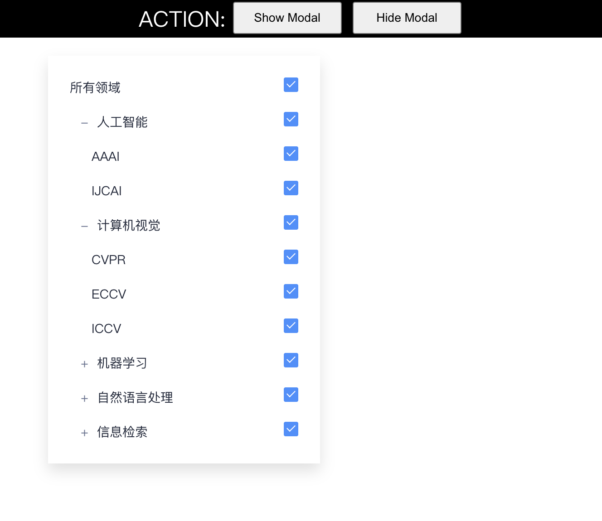

# JS Filed Picker

A JavaScript Field Picker written by vanilla JS.



## Data Format

```bash
{
  data: [
    { name: "All", cname: "所有领域", code: "all" },
    {
      name: "Artificial intelligence",
      cname: "人工智能",
      rel: [
        { name: "ACM SIGAI", link: "http://sigai.acm.org/index.html" },
        { name: "AAAI", link: "https://aaai.org/" },
      ],
      code: "ai",
      children: [
        { name: "AAAI", cname: "AAAI", code: "aaai", checked: true, link: "https://csconferences.org/#AAAI" },
        { name: "IJCAI", cname: "IJCAI", code: "ijcai", checked: true, link: "https://csconferences.org/#IJCAI" },
      ],
    },
    {
      name: "Computer vision",
      cname: "计算机视觉",
      code: "cv",
      rel: [{ name: "CVF", link: "https://www.cv-foundation.org/" }],
      children: [
        { name: "CVPR", cname: "CVPR", code: "cvpr", checked: true, link: "https://csconferences.org/#CVPR" },
        { name: "ECCV", cname: "ECCV", code: "eccv", checked: true, link: "https://csconferences.org/#ECCV" },
        { name: "ICCV", cname: "ICCV", code: "iccv", checked: true, link: "https://dblp.org/db/conf/iccv/index.html" },
      ],
    },
    {
      name: "Machine learning",
      cname: "机器学习",
      code: "ml",
      rel: [
        { name: "ACM SIGKDD", link: "https://www.kdd.org/" },
        { name: "ICLR", link: "https://iclr.cc/" },
        { name: "IMLS", link: "http://www.machinelearning.org/" },
        { name: "NEURIPS/NIPS", link: "https://neurips.cc/" },
      ],
      children: [
        { name: "ICLR", cname: "ICLR", code: "iclr", checked: true, link: "https://csconferences.org/#ICLR" },
        { name: "ICML", cname: "ICML", code: "icml", checked: true, link: "https://csconferences.org/#ICML" },
        { name: "NeurIPS", cname: "NeurIPS", code: "neurips", checked: true, link: "https://csconferences.org/#NeurIPS" },
        { name: "KDD", cname: "KDD", code: "kdd", checked: false, link: "https://dblp.org/db/conf/kdd/index.html" },
      ],
    },
    ...
  ],
}
```

## Preview


